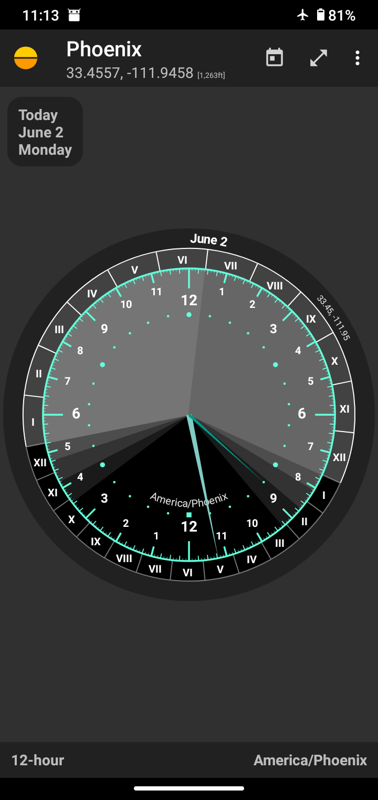
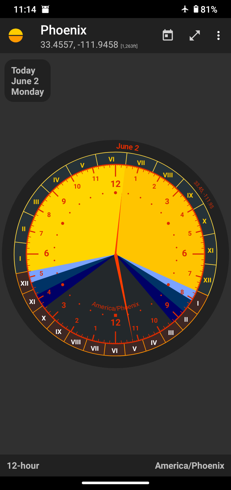

# Natural Hour
A 24-hour clock &amp; roman timekeeping add-on for Suntimes. It depends on [Suntimes v0.10.3](https://f-droid.org/en/packages/com.forrestguice.suntimeswidget/) or later.

[](https://github.com/forrestguice/NaturalHour/releases)

* [Donations](#donations)
* [Bug Reports](#bug-reports)
* [Privacy and Permissions](#privacy-and-permissions)
* [Legal Stuff](#legal-stuff)

Features:
* A 24-hr clock face with roman timekeeping divisions; hours, twilight, and night watches.
* Repeating alarms and notifications (requires Suntimes `v0.14.0` or later).
* Home screen widgets (resizable clock widgets).
* Quick settings tile that displays the current hour.
* Daydream / screensaver that shows a "wandering clock".
* Quick navigation to the dates of the solstices and equinoxes.
* The app announces the current time (and roman hour) when the clock is clicked.

Options for:
* time zone (local mean time, apparent solar time, UTC, system, or app time zone), and time format (24hr, 12hr, or 6hr).
* other equinoctial hours; Babylonian, Italic, Italian Civil, or Julian.
* temporal hours; the day begins at sunrise/sunset (12), dawn/dusk (12), dawn (24), sunrise (24), noon (24), sunset (24), or dusk (24).
* clock colors (custom color schemes), and other customizations.
* clock orientation; show "midnight at top", "center on noon".
* clock numerals; Arabic, Attic, Armenian, Etruscan, Greek, Hebrew, Roman.
* night watches; 2, 3, 4, or more divisions.
* seconds; a "seconds dial" and "seconds hand".
* fullscreen mode (over the home screen wallpaper).

 

## Donations ##
Do you find value in this software? Please pay as you feel.

[](https://www.paypal.com/cgi-bin/webscr?cmd=_s-xclick&hosted_button_id=NZJ5FJBCKY6K2)

<noscript><a href="https://liberapay.com/forrestguice/donate"></a></noscript>


## Bug Reports ##
Use the issue tracker to submit a bug report or a feature request.

When reporting a bug please be detailed as possible. What did you expect the app to do, what did you actually observe? Include the app version numbers in your report. Other useful information includes the Android OS version (and sometimes your specific device model).

## Privacy and Permissions ##
Natural Hour does not collect, store, or transmit personal user data. It contains no advertising, no analytics, no trackers, and no unnecessary permissions.

__Natural Hour is an add-on for Suntimes.__ It uses the `suntimes.permission.READ_CALCULATOR` permission in order to access data provided by this app. https://github.com/forrestguice/SuntimesWidget/wiki/Privacy

## Legal Stuff
Copyright (C) 2020-2025 **Forrest Guice**
```
Natural Hour is free software: you can redistribute it and/or modify
it under the terms of the GNU General Public License as published by
the Free Software Foundation, either version 3 of the License, or
(at your option) any later version.

Natural Hour is distributed in the hope that it will be useful,
but WITHOUT ANY WARRANTY; without even the implied warranty of
MERCHANTABILITY or FITNESS FOR A PARTICULAR PURPOSE.  See the
GNU General Public License for more details.

You should have received a copy of the GNU General Public License
along with Natural Hour.  If not, see <http://www.gnu.org/licenses/>.
```

Icons from:
* "Google Material Icons" [Apache License 2.0] (https://material.io/icons/)
